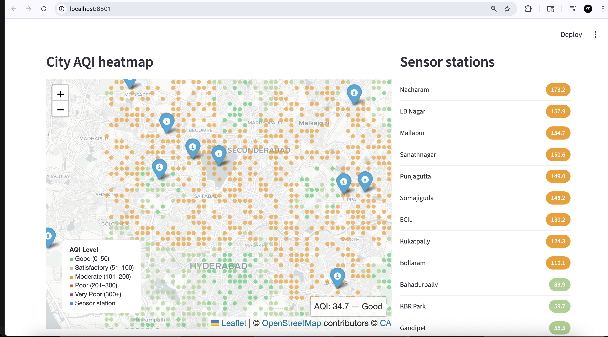
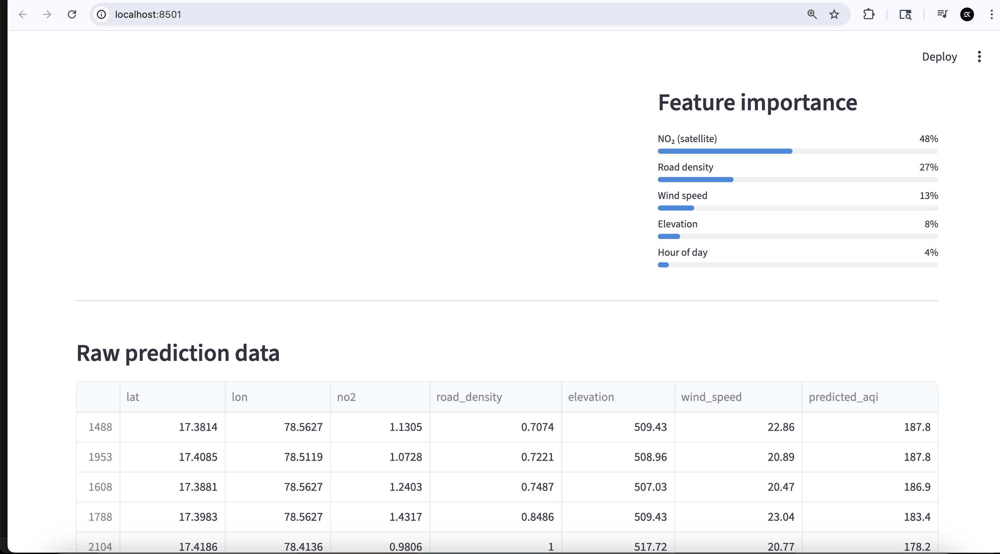

#  AQI Lens Hyperlocal Air Quality Predictor
<p align="center">
  
  
  
  
</p>

Predicts street-level air quality at **100m resolution** across Hyderabad including areas with **zero physical sensors** by fusing satellite NO₂ data with ground sensor readings using XGBoost regression.

---

## Screenshots

### City AQI Heatmap

*Interactive heatmap showing predicted AQI across Hyderabad. Orange = Moderate (101–200), Green = Good/Satisfactory. Blue pins = CPCB sensor stations with live readings.*

### Feature Importance & Raw Prediction Data

*NO₂ satellite data (48%) and road density (27%) are the strongest predictors. The table shows raw per-cell predictions with all input features.*

---

## The Problem

Hyderabad has ~12 government air quality sensors for a city of **10 million people**. That means most streets have no idea what their air quality actually is — yet people commute, exercise, and live in areas with potentially hazardous pollution.

---

## The Solution

AQI Lens builds a **3,600-cell geospatial grid** over the city and predicts AQI for every cell — including those far from any sensor — using a geography-aware ML model. Not simple distance interpolation, but feature-rich spatial prediction accounting for roads, terrain, and wind.

---

## How It Works

```
Sentinel-5P Satellite (NO₂ data)
        +
CPCB Ground Sensors (12 locations)
        ↓
Feature Engineering per 100m grid cell:
  • NO₂ concentration  →  48% feature importance
  • Road density       →  27% feature importance
  • Wind speed         →  13% feature importance
  • Elevation          →   8% feature importance
  • Hour of day        →   4% feature importance
        ↓
XGBoost Regression Model
(trained on sensor cells, predicts all 3,600 cells)
        ↓
Interactive Streamlit Dashboard
with real-time Folium heatmap + sensor station panel
```

---

## Key Features

- **City-wide AQI heatmap** at 100m spatial resolution across Hyderabad
-  **Live sensor station panel** — real-time AQI readings from all 12 CPCB stations
-  **ML-powered prediction** for sensor-absent areas using XGBoost
-  **Satellite data integration** — Sentinel-5P NO₂ readings via Google Earth Engine
- **Feature importance visualization** — understand what drives AQI predictions
- **Raw prediction table** — inspect per-cell predictions with all input features
- ⚡ **Streamlit web app** — runs locally in one command

---

## 🛠️ Tech Stack

| Layer | Technology |
|---|---|
| ML Model | XGBoost (Gradient Boosted Regression) |
| Web App | Streamlit |
| Map Visualization | Folium + Leaflet |
| Geospatial Processing | GeoPandas |
| Data Processing | Pandas, NumPy |
| Satellite Data | Sentinel-5P (simulated; production uses Google Earth Engine) |

---

## 📁 Project Structure

```
aqi-lens/
├── app.py          # Streamlit web app & dashboard
├── model.py        # XGBoost training + prediction pipeline
├── features.py     # Grid generation + feature engineering
├── data.py         # CPCB sensor data + NO₂ grid simulation
└── requirements.txt
```

---

## 🚀 Run Locally

```bash
git clone https://github.com/Sumithkokkula/AQI-lens.git
cd AQI-lens
python3 -m venv venv
source venv/bin/activate      # Windows: venv\Scripts\activate
pip install -r requirements.txt
streamlit run app.py
```

Open `http://localhost:8501` in your browser.

---

## Results

| Metric | Value |
|---|---|
| Grid resolution | 100m × 100m |
| Total grid cells | 3,600 |
| CPCB training sensors | 12 |
| Top predictor | NO₂ satellite data (48%) |
| Highest AQI station | Nacharam — 173.2 (Moderate) |
| Lowest AQI station | Gandipet — 55.5 (Satisfactory) |

---

## Future Improvements

- [ ] Integrate live Sentinel-5P data via Google Earth Engine API
- [ ] Add temporal forecasting (predict AQI 24h ahead)
- [ ] Deploy on Streamlit Cloud / Hugging Face Spaces
- [ ] Add health advisory alerts per zone

---

## 👤 Author

**Sumith Kokkula** · [LinkedIn](https://www.linkedin.com/in/sumith-kokkula-6a240b329) · [GitHub](https://github.com/Sumithkokkula)
